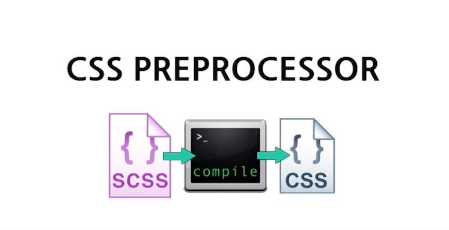
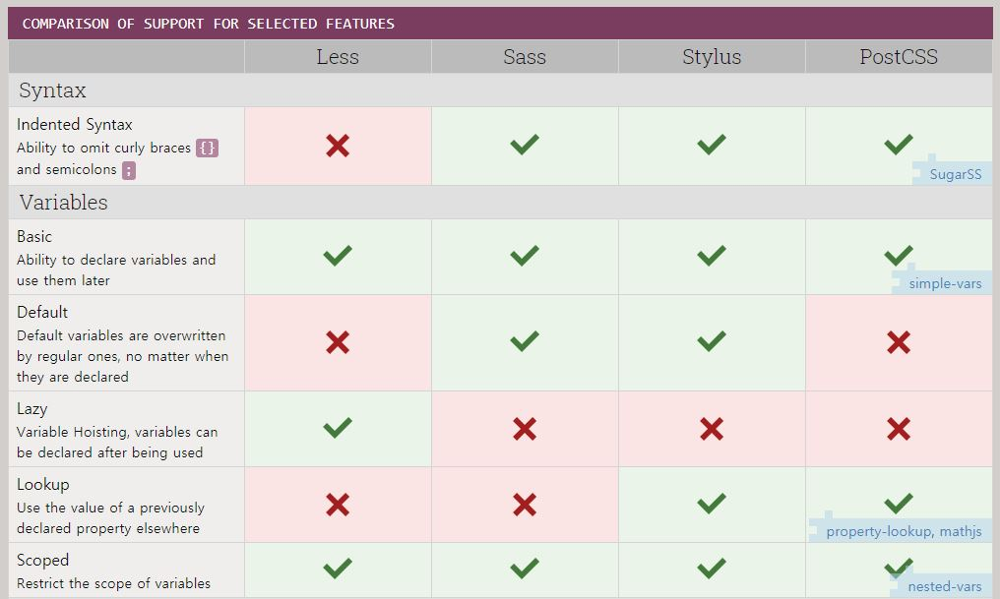
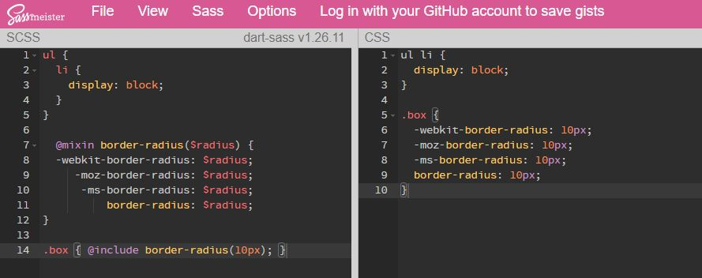
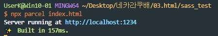
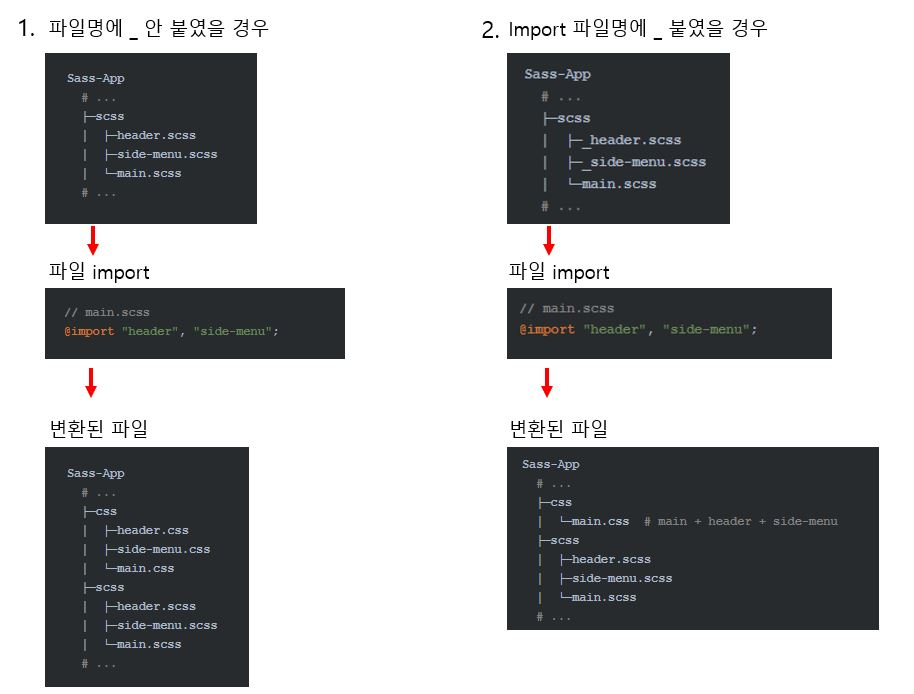

# SASS

## 1. SASS 개요

### 1.1 CSS 전처리기(Preprocessor)

- CSS 전처리기 는 별도의 컴파일과정을 통해 **CSS의 기능을 확장하고, 반복적인 작업을 자동화할 수 있게 도와 주는 툴** 입니다. CSS 만을 이용하면 코드 작성과 유지보수에 불편함이 있는데 CSS 전처리기(Sass, Less, Stylus 등)를 통해 선택자의 중첩, 다양한 단위의 연산, 조건문 등 많은 기능을 사용하여 보다 편하게 코드를 작성할 수 있습니다. 웹에서는 CSS 코드만 동작하기 때문에 CSS 전처리기로 작성한 코드를 컴파일하여 사용할 수 있습니다.  
  
- CSS 전처리기의 종류는 다음과 같습니다.
  종류 | 홈페이지
  :---:|:---:|
  **Less** <br>(Leaner Style Sheets)|[📄](https://lesscss.org/)
  **Sass** <br>(Syntactically Awesome Style Sheets) |[📄](https://sass-lang.com/)
  **Stylus**|[📄](https://stylus-lang.com/)
  **PostCSS**|[📄](https://postcss.org/)

  [Compare CSS PREprocessors](https://csspre.com/compare/)에서 각 특징을 비교해볼 수 있습니다.
  

### 1.2 SASS 의 장점

- CSS 호환성이 좋습니다. 기존에 작성된 CSS 파일을 확장자만 scss 로 변경해도 정상적으로 컴파일이 수행됩니다.
- 풍부한 기능을 제공합니다.
- 오랜 기간동안 운영/개발 되어졌기 때문에 완성도가 있습니다.
- gulp, 웹팩같은 태스크러너에서 다른 플러그인과 조합했을 때 활용성이 좋습니다.
- 많은 기업이 Sass를 도입해 코드를 작성하고 있습니다.

### 1.3 Sass vs SCSS 문법

- 기존 CSS 문법을 그대로 활용할 수 있는 SCSS 문법이 Sass 3버전에 추가되었습니다. CSS 문법과 유사하여 호환성이 높아졌습니다.

- Sass 문법과의 차이점은 `{}`(중괄호)와 `;`(세미콜론)의 유무입니다. Sass는 선택자의 유효범위를 `‘들여쓰기’`로 구분하고, SCSS는 `{}`로 범위를 구분합니다.

  ```css
  /* scss 문법 */
  ul {
    li {
      display: block;
    }
  }
  ```

  ```css
  /* sass 문법 */
  ul
    li
        display: block
  ```

  ```css
  /* compiled CSS */
  ul li {
    display: block;
  }
  ```

- Mixins 기능에서도 sass, scss 문법의 차이가 있습니다. Sass는 `=`와 `+`기호로 Mixins 기능을 사용하고, SCSS는 `@mixin`과 `@include`로 기능을 사용합니다.

  ```css
  /* scss 문법 */
  @mixin border-radius($radius) {
    -webkit-border-radius: $radius;
    -moz-border-radius: $radius;
    -ms-border-radius: $radius;
    border-radius: $radius;
  }

  .box {
    @include border-radius(10px);
  }
  ```

  ```css
  /* sass 문법 */
  =border-radius($radius)
    -webkit-border-radius: $radius
    -moz-border-radius:    $radius
    -ms-border-radius:     $radius
    border-radius:         $radius

  .box
    +border-radius(10px)
  ```

  ```css
  /* compiled CSS */
  .box {
    -webkit-border-radius: 10px;
    -moz-border-radius: 10px;
    -ms-border-radius: 10px;
    border-radius: 10px;
  }
  ```

### 1.4 컴파일 방법

- SassMeister
  간단한 Sass 코드는 컴파일러 설치 없이 [SassMeister 페이지](https://www.sassmeister.com/)에서 바로 CSS 로 변환해 볼 수 있습니다. Sass 컴파일러 버전과 작성문법을 선택하여 비교할 수도 있습니다.
  아래 예시는 SCSS 문법, dart-sass v1.26.11 컴파일러를 선택해 작성한 것으로 왼쪽에 Sass 코드를 적으면 오른쪽에서 변환된 CSS를 확인할 수 있습니다.
  

- Sass 설치 (npm 이용)
  node, npm이 설치된 환경에서는 Sass를 설치하여 사용할 수 있습니다.

  - Sass 설치
    `$ (sudo) npm install -g sass`
  - 설치(버전) 확인
    `$ sass --versioin`
  - Sass 컴파일
    ```bash
    $ sass input.scss output.css
    # 혹은
    $ sass input.scss:output.css
    ```
  - Sass 컴파일할 때 --watch 옵션을 추가하면 수정될 때마다 자동으로 컴파일됩니다.
    `$ sass --watch input.scss:output.css`
  - 컴파일된 CSS파일의 formatting style 지정 (expanded는 풀어쓴 형태, compressed는 minify된 형태)
    `--style [expanded, compressed]`

- Parcel 설치
  웹 애플리케이션 번들러 Parcel 을 통해서도 Sass 컴파일은 쉽게 할 수 있습니다.

  - Parcel 설치
    `$ npm install -g parcel-bundler`
  - 프로젝트에 package.json 생성
    `$ npm init -y`
  - 프로젝트에 Sass 컴파일러(node-sass) 설치

    ```bash
    $ npm install --save-dev node-sass
    # 혹은
    $ npm i -D node-sass
    ```

  - HTML 파일에 <link>로 Sass 파일 연결
    `<link rel="stylesheet" href="scss/main.scss">`
  - Parcel 실행
    dist/에서 컴파일된 Sass 파일을 볼 수 있고, 별도의 포트 번호를 설정하지 않았다면 http://localhost:1234에 접속하여 적용상태를 확인할 수 있습니다. Sass 파일 변경시 변경사항을 실시간으로 확인 가능합니다.

    ```bash
    $ npx parcel index.html
    # 혹은
    $ parcel build index.html
    ```

    

- 이외에도 node-sass, Gulp, Webpack을 이용해 컴파일 할 수 있습니다.

## 2. SASS 문법

### 2.1 주석

- CSS 주석은 `/* */`을 사용합니다. 이 형식을 사용하면 Sass 파일을 컴파일한 CSS 파일에서도 주석이 남아있게 됩니다.
- Sass에서는 `// 주석내용` 을 사용하여 주석을 작성할 수 있는데 이렇게 작성할 경우 컴파일한 CSS 파일에서는 보이지 않습니다. 즉, CSS로 컴파일되지 않아도 되는 내용의 주석을 작성할 경우에는 `//`을 사용합니다.
- 여러 줄 주석을 사용할 경우 기존의 sass 문법에서는 각 줄 앞에 `*`을 붙여야 하고, 줄바꿈 되는 주석의 `*`위치가 같아야 합니다. scss 문법은 각 줄에 `*`이 없어도 가능하며 CSS와 호환이 쉽습니다.

  ```css
  /* sass 문법 */

  /* 컴파일되는
   * 여러 줄
   * 주석 */
  ```

  ```css
  /* sass 문법 */
  /* 주석의 라인이 다를 경우 에러가 발생합니다 */

  /* 컴파일되는
  * 여러 줄
      * 주석 */
  ```

  ```css
  /* scss 문법 */

  /*
  컴파일되는
  여러 줄
  주석
  */
  ```

### 2.2 데이터 종류

| 데이터   | 설명                            | 특이사항                                                               | 예시                                      |
| :------- | :------------------------------ | :--------------------------------------------------------------------- | :---------------------------------------- |
| Numbers  | 숫자                            | 단위도 포함됩니다                                                      | 1, .82, 20px, 2em                         |
| Strings  | 문자                            | 따옴표가 없어도 가능합니다                                             | bold, relative, "/images/a.png", "dotum"  |
| Colors   | 색상 표현                       | red 와 같이 색상을 나타내는 키워드 문자열은 Colors 데이터에 해당합니다 | red, blue, #FFFF00, rgba(255,0,0,.5)      |
| Booleans | 논리                            | &nbsp;                                                                 | true, false                               |
| Nulls    | 아무것도 없음                   | 속성값으로 null을 사용하면 컴파일되지 않습니다                         | null                                      |
| Lists    | 공백이나 `,`로 구분된 값의 목록 | `()`를 붙이거나 안붙여도 가능합니다                                    | `(apple, orange, banana)`, `apple orange` |
| Maps     | Key: Value 형태의 값            | `()`를 꼭 붙여야 합니다                                                | (apple: a, orange: o, banana: b)          |

### 2.3 중첩

- 자식 선택자를 부모 선택자 블록 안에 중첩하여 쓸 수 있습니다. 부모 선택자를 반복해서 쓰지 않아도 되고, 가독성이 더 뛰어나며 구조화된 느낌의 코드를 작성할 수 있습니다. 중첩을 너무 남발하게 되면 들여쓰기 뎁스가 깊어지면서 오히려 가독성이 떨이질 수 있고, 컴파일된 CSS에도 불필요한 셀렉터가 포함될 수 있으므로 가급적 3뎁스 이내의 중첩으로 작성하는 것을 추천합니다.

  ```css
  /* scss 문법 */

  .section {
    background: white;

    .title {
      color: green;
    }
    .description {
      text-align: center;
    }
    .description_list {
      margin: 20px 0;
      padding: 20px;
      border: 1px solid gray;
      dd {
        font-size: 15px;
        line-height: 20px;
      }
    }
  }
  ```

  ```css
  /* compiled CSS */

  .section {
    background: white;
  }
  .section .title {
    color: green;
  }
  .section .description {
    text-align: center;
  }
  .section .description_list {
    margin: 20px 0;
    padding: 20px;
    border: 1px solid gray;
  }
  .section .description_list dd {
    font-size: 15px;
    line-height: 20px;
  }
  ```

- 중첩 안에서 `&`를 이용하여 상위(부모) 선택자를 참조할 수 있습니다. 클래스를 이용한 일치 선택자, 가상클래스, 가상요소 선택자를 사용할 때 편리합니다.

  ```css
  /* scss 문법 */

  a {
    font-weight: bold;
    text-decoration: none;

    &:hover {
      text-decoration: underline;
    }
  }
  ```

  ```css
  /* compiled CSS */

  a {
    font-weight: bold;
    text-decoration: none;
  }
  a:hover {
    text-decoration: underline;
  }
  ```

  - 단순 부모 셀렉터명만 가져오는 것이 아니고 네스팅된 모든 셀렉터를 가져옴을 주의해야 합니다.

    ```css
    /* scss 문법 */

    .espresso {
      color: red;

      .cappuccino {
        color: orange;

        .latte {
          .a_class {
            .b_class {
              &.last {
                // 깊은 중첩에서의 부모 참조 선택자
                color: yellow;
              }
            }
          }
        }
      }
    }
    ```

    ```css
    /* compiled CSS */

    .espresso {
      color: red;
    }
    .espresso .cappuccino {
      color: orange;
    }
    .espresso .cappuccino .latte .a_class .b_class.last {
      color: yellow;
    }
    ```

  - `&`의 위치에 따라 다양하게 사용할 수 있습니다.

    ```css
    /* scss 문법 */

    // 접미사로 사용한 예시
    .latte {
      .cappuccino & {
        font-size: 11px;
      }
    }

    // 접두사로 사용한 예시, BEM 지원
    .give_me_a {
      &-espresso {
        color: red;
      }
      .please &-americano {
        color: orange;
      }
    }
    ```

    ```css
    /* compiled CSS */

    .cappuccino .latte {
      font-size: 11px;
    }

    .give_me_a-espresso {
      color: red;
    }
    .please .give_me_a-americano {
      color: orange;
    }
    ```

- `@at-root` 를 사용해 중첩에서 벗어날 수 있습니다. 중첩안에서 생성하고 중첩 밖에서 사용할 때 유용합니다. 아래 예시는 특정 변수를 범위 밖에서 사용할 수 없기 때문에, `@at-root`를 이용해 범위 안에서 생성하고 중첩 밖에서 사용하는 것을 보여줍니다.

  ```css
  /* scss 문법 */

  .list {
    $w: 100px;
    $h: 50px;
    li {
      width: $w;
      height: $h;
    }
    @at-root .box {
      width: $w;
      height: $h;
    }
  }
  ```

  ```css
  /* compiled CSS */

  .list li {
    width: 100px;
    height: 50px;
  }
  .box {
    width: 100px;
    height: 50px;
  }
  ```

- 동일한 네임 스페이스(font-, margin- 등)을 가지는 속성도 중첩하여 사용할 수 있습니다.

  ```css
  /* scss 문법 */

  .box {
    font: {
      weight: bold;
      size: 10px;
      family: sans-serif;
    }
    margin: {
      top: 10px;
      left: 20px;
    }
    padding: {
      bottom: 40px;
      right: 30px;
    }
  }
  ```

  ```css
  /* compiled CSS */

  .box {
    font-weight: bold;
    font-size: 10px;
    font-family: sans-serif;
    margin-top: 10px;
    margin-left: 20px;
    padding-bottom: 40px;
    padding-right: 30px;
  }
  ```

### 2.4 변수

- 반복적으로 사용되는 값을 `$변수이름: 속성값;` 으로 지정할 수 있습니다.

  ```css
  /* scss 문법 */
  $color-normal: #666;
  $color-point: #f00;

  a {
    color: $color-normal;

    &:hover {
      color: $color-point;
    }
  }
  ```

  ```css
  /* compiled CSS */

  a {
    color: #666;
  }
  a:hover {
    color: #f00;
  }
  ```

- 최상위에 선언시 전역변수로, 블록(`{}`) 안에 선언시 해당 블록안에서만 유효한 지역변수로 동작합니다.

  ```css
  /* scss 문법 */

  .box1 {
    $color: #111;
    background: $color;
  }

  // Error
  .box2 {
    background: $color;
  }
  ```

- 변수에 특정한 값 뿐만 아니라 다른 변수를 할당하여 값을 정의할 수도 있습니다. 이를 변수 재할당이라고 합니다.

  ```css
  /* scss 문법 */
  $red: #ff0000;
  $blue: #0000ff;

  $color-primary: $blue;
  $color-danger: $red;

  .box {
    color: $color-primary;
    background: $color-danger;
  }
  ```

  ```css
  /* compiled CSS */
  .box {
    color: #0000ff;
    background: #ff0000;
  }
  ```

- 변수는 선언한 블록 내에서만 사용할 수 있는데 `!global`을 사용하면 변수의 유효범위를 전역(Global)으로 설정할 수 있습니다. 기존에 선언된 변수명을 블록 내에서 전역으로 설정하면 값이 덮어쓰기 되므로 주의합니다. 즉, 변수가 적용된 곳을 기준으로 가장 가까운 곳에서 선언된 값이 지정됩니다.

  ```css
  /* scss 문법 */

  .box1 {
    $color: #111 !global;
    background: $color;
  }
  .box2 {
    background: $color;
  }
  ```

  ```css
  /* compiled CSS */

  .box1 {
    background: #111;
  }
  .box2 {
    background: #111;
  }
  ```

- 변수에 값을 설정하는데 기존에 설정한 값이 있다면 기존 값을 사용하겠다는 의미로 `!default` 를 쓸 수 있습니다. 사용자의 코드를 라이브러리가 덮어쓰기 하면 안 되기 때문에 라이브러리 내에서 사용하는 변수에서 사용합니다.

  ```css
  /* scss 문법 */

  $color-primary: red;

  .box {
    $color-primary: blue !default;
    background: $color-primary;
  }
  ```

  ```css
  /* compiled CSS */
  .box {
    background: red;
  }
  ```

- `#{}`interpolation을 통해 셀렉터명이나 속성명, 문자열 안에서도 변수를 사용할 수 있습니다.

  ```css
  /* scss 문법 */

  $family: unquote("Droid+Sans");
  $name: foo;
  $attr: border;

  @import url("http://fonts.googleapis.com/css?family=#{$family}");

  p.#{$name} {
    #{$attr}-color: blue;
  }
  ```

  ```css
  /* compiled CSS */

  @import url("http://fonts.googleapis.com/css?family=Droid+Sans");

  p.foo {
    border-color: blue;
  }
  ```

### 2.5 import (파일 가져오기)

- `@import "file_name.css"` 로 외부의 Sass 파일을 가져와 사용할 수 있습니다. 즉, 가져온 파일에 정의된 모든 변수 또는 Mixins 등을 주 파일에서 사용할 수 있습니다. Sass에서 @import 사용할 때에는 url함수를 사용하지 않습니다.

- 하나의 @import 로 여러 파일을 가져올 수 있습니다. 파일 이름은 `,`로 구분합니다. 아래는 ./ 주소가 생략된 것으로 현재 폴더에서 header.scss , footer.scss 파일을 찾아 가져오는 예시입니다.
  `@import "header", "footer";`

- 파일 분할(Partials)
  Sass는 파일 이름 앞에 `_`를 붙이면 컴파일 시에 CSS파일로 컴파일 하지 않는 Partials 기능을 지원합니다. 즉, scss파일을 모듈 또는 레이아웃 기준으로 분리하여 css 구조화를 할 수 있습니다. Webpack이나 Parcel, Gulp 같은 일반적인 빌드툴에서는 Partials 기능을 사용할 필요 없이 설정된 값에 따라 빌드되지만 명시적으로 `_`를 사용할 것을 권장합니다.
  
  아래 예시의 1번은 파일명에 `_`를 붙이지 않고 모든 파일이 css로 변환된 경우이고, 2번은 `_`를 붙여 main.scss 파일만 css파일로 변환된 경우를 보여주고 있습니다.
  

- Sass @import는 기본적으로 Sass 파일을 가져오는데, CSS @import 규칙으로 컴파일되는 몇 가지 상황이 있습니다.

  - 파일 확장자가 `.css`일 때
    `@import "hello.css";`
  - 파일 이름이 `http://`로 시작하는 경우
    `@import "http://hello.com/hello";`
  - `url()`이 붙었을 경우
    `@import url(hello);`
  - 미디어쿼리가 있는 경우
    `@import "hello" screen;`

### 2.6 연산 (Operations)

Sass는 기본적인 연산 기능을 제공하는데, 해당 연산을 사용하여 레이아웃 작업 시 상황에 맞게 크기를 계산하거나 정해진 값을 나눠서 작성할 수 있어 유용합니다. Sass에서 사용할 수 있는 연산자의 종류로는 산술, 비교, 논리 연산자가 존재합니다.

| 종류 | 연산자 |       설명       | 주의사항                            |
| :--: | :----: | :--------------: | :---------------------------------- |
| 산술 |  `+`   |      더하기      |
| 산술 |  `-`   |       빼기       |
| 산술 |  `*`   |      곱하기      | 피연산자 중 하나의 값이 반드시 숫자 |
| 산술 |  `/`   |      나누기      | 나누는 값이 반드시 숫자             |
| 산술 |  `%`   |      나머지      |
| 비교 |  `==`  |       동등       |
| 비교 |  `!=`  |       부등       |
| 비교 |  `<`   |    보다 작은     |
| 비교 |  `>`   |     보다 큰      |
| 비교 |  `<=`  | 보다 작거나 같은 |
| 비교 |  `>=`  | 보다 크거나 같은 |
| 논리 | `and`  |      그리고      |
| 논리 |  `or`  |       또는       |
| 논리 | `not`  |       부정       |

#### 2.6.1 숫자 (Numbers)

##### 2.6.1.1 상대적 단위 연산

- 절댓값을 나타내는 `px` 단위를 사용하여 일반적으로는 연산을 합니다.
  > 명확하게는 `px`는 해상도에 따른 '상대적 단위' 입니다.
- Sass에서의 연산은 대상을 변환하여 연산할 수 없는 경우에 에러를 출력합니다.
  - 상대적 단위인 `%`,`em`,`vw` 등을 Sass는 알지 못합니다.
    - 상대적 값의 결과값은 브라우저만이 알 수 있습니다.
    - 상대적 단위를 사용하는 연산은 동일한 단위를 갖는 값과의 연산만 유효합니다.
- CSS3의 calc 함수를 사용하면 위의 문제를 해결할 수 있습니다.
  ```scss
  /* 단위가 다르기 때문에 단위 모순 에러(Incompatible units error)가 발생한다. */
  width: 50% - 20px;
  /* 순수한 CSS 함수로 단위가 달라도 연산이 가능하다. */
  width: calc(50% - 20px);
  /* 상잭적 단위 연산 */
  width: 5% + 10%;
  ```

##### 2.6.1.2 나누기 연산의 주의사항

- `/` 연산자의 경우 CSS의 `font` 속성의 값처럼 숫자를 분리하는 방법으로도 사용하기 때문에 나누기 연산으로 사용되지 않을 수도 있습니다.
  ```scss
  p {
    font: italic bold 12px/30px Georgia, serif;
    border-radius: 10px 20px/20px;
  }
  ```
- `/` 연산자를 나누기 연산자로 사용하기 위해서는 다음과 같은 조건을 충족해야 합니다.

  1. 값 또는 그 일부가 변수에 저장되었거나 함수에 의해 반환되는 경우
  2. 괄호 내에서 사용되는 경우
  3. 다른 산술 표현식의 일부로 사용되는 경우

  ```scss
  $width: 300px;

  width: $width / 2; // 1번의 경우 -> 150px
  height: (300px / 2); // 2번의 경우 -> 150px
  margin-right: 10px + 20px / 2px; // 3번의 경우 -> 20px
  ```

#### 2.6.2 색상 (Colors)

- 모든 산술 연산자를 사용하여 색상값도 연산할 수 있습니다.
  ```scss
  p {
    color: #010203 + #040506; // #050709
    color: #010203 * 2; // #020406
    color: rbga(255, 0, 0, 0.75);
  }
  ```
- rgba 연산은 alpha 값이 동일해야 가능합니다.
  - 다만, alpha 값은 연산되지 않습니다.
  - alpha 값 연산을 위해서는 `opacify()`, `transparentize()` 함수를 사용해야 합니다.
  ```scss
  color: rgba(255, 0, 0, 0.3) + rgba(0, 0, 255, 0.3); // rgba(255, 0, 255, 0.3)
  ```

#### 2.6.3 문자 (Strings)

- 문자 연산에는 `+` 연산자가 사용되는데 자바스크립트와 같이 문자열을 연결할 수 있습니다.
- 문자 연산의 결과는 왼쪽 피연산자를 기준으로 합니다.
  ```scss
  div::after {
    /* 왼쪽 피연산자가 따옴표로 묶여있을시 연산 결과도 따옴표로 묶여있습니다. */
    content: "Hello " + World; // "Hello World"
    /* 왼쪽 피연산자가 따옴표로 묶여있지 않을시 연산 결과도 묶여있지 않습니다.*/
    flex-flow: row + "-reverse" + " " + wrap; // row-reverse wrap
  }
  ```

#### 2.6.4 논리 (Boolean)

- 논리 연산자는 자바스크립트의 `&&`, `||`, `!`와 같은 기능을 하는 연산자이며, `Sass`의 조건문인 `@if`와 `built-in if()` 함수에서 사용됩니다.
- 논리 연산자의 종류로는 `and(그리고)`, `or(또는)`, `not(부정)`이 있습니다.

  ```scss
  $width: 90px;

  div {
    @if not($width > 100px) {
      // True
      height: 300px;
    }

    @if ($width > 40px and $width < 90px) {
      // False
      height: 500px;
    }

    @if ($width > 40px or $width < 90px) {
      // True
      height: 100px;
    }
  }
  ```

### 2.7 재활용 (Mixins)

중복되는 코드를 방지하기 위해 스타일 시트 전체에서 **재사용 할 CSS 선언 그룹**을 정의하는 Sass의 매우 유용한 기능입니다. Mixin을 사용하면 다양한 스타일을 만들어 사용할 수 있습니다. 사용하는 방법은 매우 간단합니다. `@mixin`으로 선언하고 `@include`로 불러옵니다!

#### 2.7.1 @mixin

- Mixin의 선언 방법은 다음과 같습니다.

  - scss와 sass의 선언 방법에 약간의 차이점이 존재합니다.

    ```scss
    /* Scss */
    @mixin 믹스인이름 {
      스타일;
    }

    /* Sass */
    /* Sass의 경우 들여쓰기를 주의해야 합니다! */
    =믹스인이름
      스타일
    ```

  - 함수와 같이 매개 변수를 사용할 수도 있습니다.

    ```scss
    @mixin size($w, $h) {
      width: $w;
      height: $h;
    }

    .box {
      @include size(100px, 200px);
    }
    ```

  - 선택자를 포함 할 수 있으며, 상위(부모) 요소 참조(`&`)도 가능합니다.

    ```scss
    @mixin deco-text {
      &::after {
        content: "!!";
      }

      span.icon {
        background-image: url("/image/smail-icon.png");
      }
    }
    ```

#### 2.7.2 @include

- `@include`는 선언된 Maxin을 불러오기 위해 사용하며, 사용 방법은 다음과 같습니다.

  ```scss
  /* Scss */
  @include 믹스인이름;
  .box {
    /* mixin에 전달할 인수가 없을 경우 뒤의 괄호는 생략할 수 있습니다. */
    @include deco-text;
  }

  /* Sass */
  +믹스인이름
  .box
    +deco-text
  ```

#### 2.7.3 인수 (Arguments)

- Mixin은 마치 함수처럼 인수를 가질 수 있습니다. 이러한 특성 덕분에 하나의 Mixin을 이용하여 다양한 결과를 만들어 낼 수 있습니다.
- 인수를 가질 수 있는 Mixin의 선언 방법 및 사용 방법은 다음과 같습니다.

  ```scss
  /* Scss */
  @mixin 믹스인이름($매개변수) {
    스타일;
  }
  @include 믹스인이름(인수)

  /* Sass */
  =믹스인이름($매개변수)
    스타일

  +믹스인이름(인수)
  ```

  > 매개변수(Parameters)는 제공되는 여러 데이터를 가리키기 위해 사용되는 변수를 말합니다.
  > 인수(Arguments)는 `Mixin`에 제공되는 여러 데이터들을 말합니다.

- 사용 예시는 다음과 같습니다.

  ```scss
  @mixin solid-line($width, $color) {
    border: $width solid $color;
  }

  .box1 {
    @include solid-line(1px, red);
  }
  .box2 {
    @include solid-line(4px, blue);
  }
  ```

##### 2.7.3.1 인수의 기본값 설정

- 인수가 전달되지 않았을 때 사용할 수 있는 매개 변수의 초기값을 설정할 수 있습니다.
  ```scss
  @mixin 믹스인이름($매개변수: 기본값) {
    스타일;
  }
  ```
- 사용 예시는 다음과 같습니다.

  ```scss
  @mixin size($w: 100px, $h: 100px) {
    width: $w;
    height: $h;
  }

  /* mixin에 전달할 인수가 없을 경우 뒤의 괄호는 생략할 수 있습니다. */
  .box1 {
    @include size;
  }
  .box2 {
    @include size(50px, 60px);
  }
  ```

##### 2.7.3.2 키워드 인수

- 위에서 만든 `@mixin size`을 사용할 때 `$w`의 값은 기본값을 사용하고 싶고, `$h`만 지정하고 싶을 때처럼 인수 입력 순서에 상관없이 값을 넘겨주고 싶을때 사용할 수 있습니다.
  - 단, 작성하지 않은 인수가 적용 가능하도록 기본값을 설정해 주어야 합니다.
- 사용 방법 및 예시는 다음과 같습니다.

  ```scss
  @mixin 믹스인이름($매개변수A: 기본값, $매개변수B: 기본값) {
    스타일;
  }
  @include 믹스인이름($매개변수B: 인수);

  @mixin size($w: 100px, $h: 100px) {
    width: $w;
    height: $h;
  }
  .box {
    @include size($h: 50px);
  }
  ```

##### 2.7.3.3 가변 인자

- 입력할 인수의 개수가 불확실한 경우에 가변 인수를 사용할 수 있습니다.
  - 가변 인수 사용 방법은 매개변수 뒤에 `...`을 붙여주면 됩니다.
- 사용 방법 및 예시는 다음과 같습니다.

  ```scss
  @mixin 믹스인이름($매개변수...) {
    스타일;
  }
  @include 믹스인이름(인수A, 인수B, 인수C);

  @mixin bg($w, $h, $bg-values...) {
    width: $w;
    height: $h;
    background: $bg-values;
  }
  .div {
    @include bg(100px, 200px, url("images/x.png") no-repeat 10px 20px,
                url("images/y.png") no-repeat
                );
  }
  ```

##### 2.7.3.4 @content

- `@mixin`에 `@content`가 포함되어 있다면 해당 부분에 원하는 스타일 블록을 전달할 수 있습니다. 해당 방식을 사용하게 되면 기존 `@mixin`이 가지고 있는 기능에 추가로 선택자나 속성 등을 작성할 수 있습니다.
- 사용 방법 및 예시

  ```scss
  @mixin 믹스인이름() {
    스타일;
    @content;
  }
  @include 믹스인이름() {
    /* 스타일 블록 */
    스타일;
  }

  @mixin icon($url) {
    $::after {
      content: $url;
      @content;
    }
  }
  .icon1 {
    @include icon("/images/icon.png") {
      /* 위에 @content 부분에 해당 스타일 블록이 들어갑니다.*/
      position: absolute;
    };
  }
  ```

### 2.8 확장 (Extend)

- 특정 선택자가 기존에 있는 스타일을 상속받고자 하는 경우에 사용할 수 있습니다.
- `@extend`를 사용하기 전에 다음과 같은 문제를 고려해야 합니다.
  - 상속을 받으려는 현재 선택자가 어디에 첨부될 것인가?
  - 상속을 사용함으로써 원치 않는 부작용이 생길 수 있는가?
  - 이 한 번의 확장으로 얼마나 큰 CSS가 생성될 수 있는가?
    > 상속은 위에서 본 것처럼 고려할 부분이 많습니다.
    > 그러므로 `@extend`의 사용은 가급적으로 자제하고 `@mixin`을 사용하는 것을 추천합니다.
- 사용 방법 및 예시는 다음과 같습니다.

  ```scss
  @extend 선택자;

  .error {
    border: 1px #f00;
    background-color: blue;
  }
  .seriousError {
    @extend .error;
    border-width: 3px;
  }

  /* 컴파일 결과는 아래와 같습니다 */
  /* @extend 사용시 ','로 구분하는 다중 선택자가 생성됩니다. */
  .error,
  .seriousError {
    border: 1px #f00;
    background-color: blue;
  }
  .seriousError {
    border-width: 3px;
  }
  ```

### 2.9. 함수 (Function)

`@mixin`과 비슷하지만 다른 부분은 mixin은 정의된 스타일을 인자를 받아 반환하지만 함수는 `@retrun`을 통해 값을 반환합니다 호출 할 때도 `@include`와 다르게 `함수이름(인수)`와 같은 방법으로 바로 호출할 수 있습니다.

다음과 같이 사용할 수 있습니다.

```scss
@function 함수이름($매개변수) {
  @return 값;
}
```

예를 들어 다음과 같이 분할된 컬럼에서 차지할 비율을 정하는 함수를 생성할 수 있습니다.

```scss
@function columns($max-width, $number: 1, $columns: 12) {
  @return $max-width * ($number / $columns);
}
```

가변인자를 리스트로 받아 순회하여 사용할 수도 있습니다.

```scss
@function test($args...) {
  $new: ();
  @each $arg in $args {
    $new: append($new, $arg + 1);
  }
  @return $new;
}

div {
  test: test(1, 2, 3, 4, 5, 6);
}
```

```scss
div {
  test: 2 3 4 5 6 7;
}
```

매개 변수에 초기값을 지정 해 줄수도 있으며 필요시에는 인자를 받아 매개변수에 할당해서 호출 할 수 있습니다.

```scss
.box_group {
  $width: 980px;

  .box1 {
    width: columns($width); // 1, 12 => 1/12 = 81.667
  }
  .box2 {
    width: columns($width, 8); // 8, 12 => 8/12 = 653.33
  }
  .box3 {
    width: columns($width, 3); // 3, 12 => 3/12 =245
  }
}
```

이렇게 호출해서 사용할 수 있습니다. 물론 CSS, SCSS내의 내장함수와 함수 이름이 충돌하지 않도록 주의해야 합니다. 만약 함수이름을 rgb로 지정한다면 css에서 색상을 지정하는 `rgb()` 함수와 이름이 중복될 수 있습니다.

### 2.10. 조건과 반복 (Flow Control)

#### 2.10.1 조건문 if로 할당하기 (함수 사용)

if함수를 사용해서 다음과 같은 방법으로 조건문을 통해 값을 바로 할당할 수 있습니다.

```scss
$is: true;

div {
  width: if($is, 100px, auto);
  // if(조건, 참일경우, 거짓일경우)
}
```

일반적인 프로그래밍언어의 삼항 조건문과 비슷하게 사용됩니다.

#### 2.10.2 조건문 if로 분기 처리하기

`@if` 지시어를 통해 일반적인 분기 처리가 가능합니다. `@else` `@else if` 모두 사용 가능합니다. 조건을 넣을 때 괄호`()`는 선택사항 입니다.

```scss
$color: orange;
div {
  @if $color == strawberry {
    color: #fe2e2e;
  } @else if $color == orange {
    color: #fe9a2e;
  } @else if $color == banana {
    color: #ffff00;
  } @else {
    color: #2a1b0a;
  }
}
```

조건문에 논리 연산자 `and`, `or`, `not`또한 이용 가능합니다.

#### 2.10.3 증가하는 정수를 활용한 반복문 사용하기

반복문은 특정 횟수를 반복하면서 스타일을 생성합니다. 정수를 1씩 증가시키면서 변수에 값을 할당하여 사용 할 수 있습니다.

`@for` 지시어를 통해 사용할 수 있으며 두가지 방법이 있습니다.

```scss
@for $i from 1 through 3 {
  // for(i ; i <= 3 ; i++) 와 같습니다.
  //반복내용
}
@for $i from 1 to 3 {
  // for(i ; i < 3 ; i++) 와 같습니다.
  //반복내용
}
```

다음과 같이 `$i`에 할당된 값을 활용할 수 있습니다.

```scss
// 1부터 3번 반복
@for $i from 1 through 3 {
  .through:nth-child(#{$i}) {
    width: 20px * $i;
  }
}

// 1부터 3 직전까지만 반복(2번 반복)
@for $i from 1 to 3 {
  .to:nth-child(#{$i}) {
    width: 20px * $i;
  }
}
```

컴파일 한다면 다음과 같이 `$i`에 할당된 변수에 맞는 스타일을 생성합니다.

```scss
.through:nth-child(1) {
  width: 20px;
}
.through:nth-child(2) {
  width: 40px;
}
.through:nth-child(3) {
  width: 60px;
}

.to:nth-child(1) {
  width: 20px;
}
.to:nth-child(2) {
  width: 40px;
}
```

#### 2.10.4 List, Map의 요소를 활용한 반복문 사용하기

SCSS의 데이터 타입 중 List와 Map의 요소를 순회하며 반복문을 사용할 수 있습니다. 마치 프로그래밍 언어의 for in과 비슷합니다.

List와 함께 사용할 경우 다음과 같이 요소를 변수에 할당하여 사용할 수 있습니다.

```scss
$fruits: (apple, orange, banana, mango); // List 할당

.fruits {
  @each $fruit in $fruits {
    //fruits List안에 있는 요소들을 fruit변수에 할당하여 순회
    $i: index(
      $fruits,
      $fruit
    ); //index 함수를 사용해서 fruits안의 $fruit요소의 인덱스를 할당
    li:nth-child(#{$i}) {
      left: 50px * $i;
    }
    li:nth-child(#{$i})::after {
      content: quote($fruit);
    }
  }
}
```

위와 같은 방식으로 인덱스를 활용할 수도 있습니다. index함수를 사용할 때 인덱스는 1부터 시작합니다. 참고로 결과는 다음과 같습니다

```scss
.fruits li:nth-child(1) {
  left: 50px;
}
.fruits li:nth-child(1)::after {
  content: "fruit";
}
.fruits li:nth-child(2) {
  left: 100px;
}
.fruits li:nth-child(2)::after {
  content: "fruit";
}

//... 생략 ...
```

Map의 요소를 순회할 수도 있습니다. Map은 Key와 Value가 있기 때문에 각 각 할당하여 순회합니다.

```scss
$fruits-data: (
  apple: korea,
  orange: china,
  banana: japan,
);

@each $fruit, $country in $fruits-data {
  // fruits-data Map의 Key를 $fruit에 Value를 $country에 할당하여 순회
  .box-#{$fruit} {
    background: url("/images/#{$country}.png");
  }
}
```

#### 2.10.5 조건문을 통한 반복 사용하기

`@while` 지시어를 통해 조건이 `false`가 될 때까지 계속 반복할 수 있습니다. 이 또한 프로그래밍 언어의 while과 비슷합니다.

```scss
$i: 6;

@while $i > 0 {
  // $i가 0보다 작아지면 종료합니다.
  .item-#{$i} {
    width: 2px * $i;
  }
  $i: $i - 2; // 반복 할 때마다 $i를 2씩 감소시킵니다.
}
```

```scss
.item-6 {
  width: 12px;
}
.item-4 {
  width: 8px;
}
.item-2 {
  width: 4px;
}
```

### 2.11. SASS의 내장함수 (Built-In Modules)

sass에는 다양한 내장함수를 제공하여 스타일규칙을 만드는데 도움을 주고 있습니다. 모든 내장함수는 [Sass Built-in Modules](https://sass-lang.com/documentation/modules)에서 확인 할 수 있으며, 유용하게 사용되는 내장 함수들을 소개합니다.

> SASS에서 인덱스는 1부터 시작합니다.

#### 2.11.1 색상 관련 내장함수

- `mix(\$color1, \$color2)` : 두 개의 색을 섞은 색을 반환합니다.
- `lighten(\$color, \$amount)` : 백분률을 지정하여 더 밝게 만든 색을 반환합니다.
- `darken(\$color, \$amount)` : 백분률을 지정하여 더 어둡게 만든 색을 반환합니다.
- `saturate(\$color, \$amount)` : 백분률을 지정하여 채도를 높인 색을 반환합니다.
- `desaturate(\$color, \$amount)` : 백분률을 지정하여 채도를 낮춘 색을 반환합니다.
- `grayscale(\$color)` : 색의 채도를 제거하여 회색조로 반환합니다.
- `invert(\$color)` : 반전된 색을 반환합니다.
- `opacify(\$color, \$amount)` / `fade-in(\$color, \$amount)` : 색상의 불투명도를 추가하여 반환합니다.
- `transparentize(\$color, \$amount)` / `fade-out(\$color, \$amount)` : 색상의 투명도를 추가하여 반환합니다.

#### 2.11.2 문자 관련 내장함수

- `unquote(\$string)` : 문자열에서 따옴표를 제거하여 반환합니다.
- `quote(\$string)` : 문자열에 따옴표를 추가하여 반환합니다.
- `str-insert(\$string, \$insert, \$index)` : 문자열 사이에 인덱스를 통해 다른 문자를 추가하여 반환합니다.
- `str-index(\$string, \$substring)` : 문자열에서 특정 문자의 인덱스를 반환합니다.
- `str-length(\$string)` : 문자열의 길이를 반환합니다.
- `str-slice(\$string, \$start-at, [\$end-at])` : 문자열을 인덱스를 이용해 슬라이싱하여 반환합니다.
- `to-upper-case(\$string)` : 문자열을 대문자로 변환하여 반환합니다.
- `to-lower-case(\$string)` : 문자열을 대문자로 변환하여 반환합니다.

#### 2.11.3 숫자 관련 내장함수

- `percentage(\$number)` : 숫자를 백분률로 변환해 반환합니다. 0은 0% 1은 100% 입니다.
- `round(\$number)` : 정수로 반올림하여 반환합니다.
- `ceil(\$number)` : 정수로 올림하여 반환합니다.
- `floor(\$number)` : 정수로 내림(버림)하여 반환합니다.
- `abs(\$number)` : 숫자의 절대 값을 반환합니다.
- `min(\$numbers…)` : 숫자 중 최소 값을 찾아 반환합니다.
- `max(\$numbers…)` : 숫자 중 최대 값을 찾아 반환합니다.
- `random()` : 0 부터 1 사이의 난수를 반환합니다.

#### 2.11.4 List 관련 내장함수

> List 관련 내장함수는 모두 Map에서도 (1: 2, 3: 4) ghrdms (1 2, 3 4)의 꼴로 사용 가능합니다.

- `length(\$list)` : List의 요소의 개수를 반환합니다.
- `nth(\$list, \$index)` : List에서 인덱스에 해당하는 값을 반환합니다.
- `set-nth(\$list, \$index, \$value)` : List에서 n번째 값을 다른 값으로 변경하여 반환합니다.
- `join(\$list1, \$list2, [\$separator])` : 두개의 리스트를 하나로 결합하여 반환합니다.
- `append(\$list, \$val, [\$separator])` : 리스트의 뒤쪽에 요소를 추가하여 반환합니다.
- `zip(\$lists…)` : 여러 List들을 하나의 다차원 List로 결합해 반환합니다.
- `index(\$list, \$value)` : List에서 요소의 index를 반환합니다.

#### 2.11.5 Map 관련 내장함수

- `map-get(\$map, \$key)` : Map에서 특정 key의 value를 반환합니다.
- `map-merge(\$map1, \$map2)` : 두 개의 Map을 병합하여 새로운 Map를 만들어 반환합니다.
- `map-keys(\$map)` : Map에서 모든 key만 List로 반환합니다.
- `map-values(\$map)` : Map에서 모든 value만 List로 반환합니다.

#### 2.11.6 환경 관련 내장함수

- `variable-exists(\$name)` : 변수의 이름을 인자로 받아 해당 변수가 현재 스코프에 존재 하는지 확인하여 불리언 값을 반환합니다.
- `global-variable-exists(\$name, \$module: null)` : 변수의 이름을 인자로 받아 해당 변수가 글로벌 변수로 존재 하는지 확인하여 불리언 값을 반환합니다. 필요에 따라 모듈의 이름을 넣어 네임스페이스를 지정 해 줄 수 있습니다.
- `mixin-exists(\$name, \$module: null)` : 믹스인의 이름을 인자로 받아 해당 믹스인이 현재 존재하는지 확인하여 불리언 값을 반환합니다. 필요에 따라 모듈의 이름을 넣어 네임스페이스를 지정 해 줄 수 있습니다.
- `function-exists(\$name)` : 함수의 이름을 인자로 받아 해당 함수가 존재하는지 확인하여 불리언 값을 반환합니다.
- `type-of(\$value)` : 인수로 받은 데이터의 타입을 반환합니다. 아래의 데이터 타입중 하나를 출력합니다.
  - number
  - string
  - color
  - list
  - map
  - bool
  - null
  - function
  - arglist
- `keywords(\$args)` : 믹스인에서 다수의 인자를 받은 경우 Map 형식으로 변환하여 반환합니다.
- `get-function(\$name, \$css: false, \$module: null)` : 함수를 변수에 할당하여 반환합니다. 변수에 할당된 함수는 인수로 전달하거나 List안에 포함시킬 수 있습니다. 변수로 지정된 함수는 call 내장함수를 통해 사용해야 합니다. 만약 get-function 함수의 인자 중 $css를 true로 호출한다면 일반 css함수를 바로 반환하기 때문에 일회성으로 사용할 수 있습니다. 필요에 따라 모듈의 이름을 넣어 네임스페이스를 지정 해 줄 수 있습니다.
- `call($function, $args...)` : `get-function` 함수를 통해 변수에 할당한 함수를 호출시킬 수 있습니다. 첫번째 인자에 함수를 할당한 변수명을 넣고, 인수로 전달할 값을 이어서 넣어 값을 반환받습니다.

## 참고 자료

- [Sass](https://sass-lang.com/)
- [Sass documntation](https://sass-lang.com/documentation)
- [Sass guidelines](https://sass-guidelin.es/ko/)
- [Heropy](https://heropy.blog/2018/01/31/sass/)
- [Naver boostcourse](https://www.boostcourse.org/web344/lecture/36667/?isDesc=false)
- [Poiemaweb](https://poiemaweb.com/sass-css-extention)
